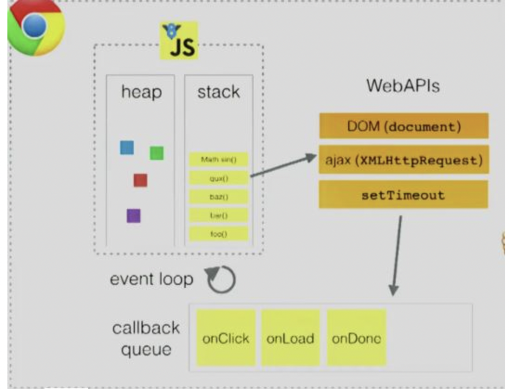

# JS 事件机制

## 导读-赶时间可以忽略

我们知道 JavaScript 是一门浏览器语言，而浏览器主要是与用户进行交互，用户当然不希望浏览器背着用户运算着什么东西，因此，与用户的交互需要时一次触发一次反馈连续，因为这样的特性，JavaScript 被设定为单线程语言，所谓单线程，指的是 JavaScript 引擎只能开启一个线程只有一个`执行栈`（调用栈），所有的函数都必须通过这个执行栈执行。

## 正文

### 非阻塞

非阻塞是当代码需要进行一项`异步任务`（无法立刻返回结果，需要花一定时间才能返回的任务，如 I/O 事件）的时候，主线程会挂起（pending）这个任务，然后在异步任务返回结果的时候再根据一定规则去执行相应的回调。

### 并发模型

JavaScript 是单线程，但浏览器使用环境并不是，浏览器存在不少阻塞的情况，为了处理这种情况，JavaScript 有一个基于事件循环的并发模型，事件循环负责执行代码、收集和处理事件以及执行队列中的子任务。

### 栈

函数调用形成了一个由若干帧组成的栈。

### 堆

对象被分配在堆中，堆是一个用来表示一大块（通常是非结构化的）内存区域的计算机术语。

### 队列

一个 JavaScript 运行时包含了一个待处理消息的消息队列。每一个消息都关联着一个用以处理这个消息的回调函数。

### 执行结构

</img>
在上图中，调用栈中遇到`DOM操作`、`ajax请求`以及`setTimeout`等 WebAPIs 的时候就会交给浏览器内核的其他模块进行处理，webkit 内核在 Javasctipt 执行引擎之外，有一个重要的模块是 webcore 模块。对于图中 WebAPIs 提到的三种 API，webcore 分别提供了`DOM Binding`、`network`、`timer`模块来处理底层实现。等到这些模块处理完这些操作的时候将回调函数放入任务队列中，之后等栈中的 task 执行完之后再去执行任务队列之中的回调函数。

### 消息队列和事件循环的配合 ♻️

其实事件循环机制和消息队列的维护是由`事件触发线程`控制的。事件触发线程同样是浏览器渲染引擎提供的，它会维护一个消息队列。JS 引擎线程遇到异步（DOM 事件监听、网络请求、setTimeout 计时器等），会交给相应的线程单独去维护异步任务，等待某个时机（计时器结束、网络请求成功、用户点击 DOM），然后由事件触发线程将异步对应的回调函数封装成任务并加入到消息队列中对应的任务队列中，等待被执行。

### 宏任务与微任务

通常我们把消息队列中的任务称为`宏任务`，每个`宏任务`中都包含了一个`微任务队列`，在执行宏任务的过程中，如果 DOM 有变化，那么就会将该变化添加到微任务列表中，这样就不会影响到宏任务的继续执行，因此也就解决了执行效率的问题。等宏任务中的主要功能都直接完成之后，这时候，渲染引擎并不着急去执行下一个宏任务，而是执行当前宏任务中的`微任务`，因为 DOM 变化的事件都保存在这些微任务队列中，这样也就解决了实时性问题。
:::tip

- MacroTask（宏观 Task） setTimeout, setInterval, requestAnimationFrame, I/O
- MicroTask（微观任务） process.nextTick, Promise（的 then,Promise 本身是同步）, Object observe, MutationObserver
  :::
  先执行同步代码，再取出第一个宏任务执行，所有的相关微任务总会在下一个宏任务之前全部执行完毕，如果执行完同步代码时有微任务就先微后宏。

  ## 总结

  浏览器有`webcore模块`和`事件触发线程`分别负责执行异步代码和维护消息队列，当 JavaScript 主线程在遇到阻塞 io 操作时，会分辨是宏任务还是微任务，微任务直接添加进微任务队列，宏任务会交由浏览器模块执行，执行完成后会由时间触发线程把异步函数打包成任务再添加进宏任务队列，待执行栈里面的同步代码都执行完了，就会先看看是否存在微任务，有则执行，随后从宏任务队列拎一个任务到执行栈执行，接着在看是否有微任务......，这样一个过程，就是 JavaScript 的事件循环机制。
