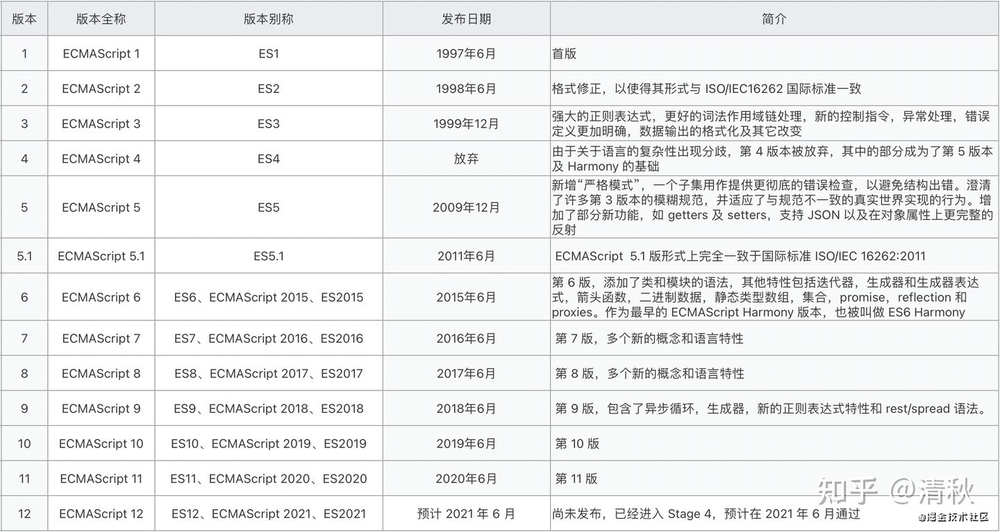

# JavaScript

## 前言

开这一篇的目的其实是作为前端开发人员也不一定清楚 JavaScript、ecmascript、es6 等的关系，包括我自己，所以开此篇厘清我们前端开发混饭吃的语言 javascript。

## ECMA

是欧洲计算机制造商协会（European Computer Manufacturers Association）的简称，是一家国际性会员制度的信息和电信标准组织。 简单说就是制定统一标准。

## ECMAScript

是一种由 Ecma 国际在标准 ECMA-262 中定义的`脚本语言` 规范。这种语言在往往被称为 JavaScript 或 JScript ，但实际上 JavaScript 和 JScript 是 ECMA-262 标准的实现和扩展。  
简单说，是一种规范，规范怎么定义，现实就怎么实现。

## javascript

javascript = ECMAScript + Dom + Bom  
其中 Dom 就是文档对象模型，Bom 是浏览对象模型（按照不同浏览器实现可能不一样），其中 Bom 是包含了 Dom，因此浏览器提供出来的 Bom 供 javascript 操作浏览器及文档对象。

## JavaScript 引擎

简单来讲，就是能够将 Javascript 代码处理并执行的运行环境，不同浏览器有不同引擎，遵循 ECMAScript 语法实现的 js 代码运行环境。

## ECMAScript 标准

简单说，ECMA 组织每年收集提案审阅，会更新一版对应标准，通常 ES6 泛指 ECMAScript2015 之后版本，也可以特质 ECMAScript2015。
</img>
